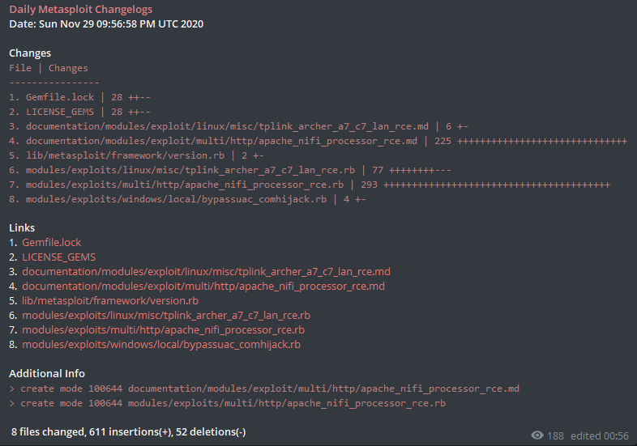
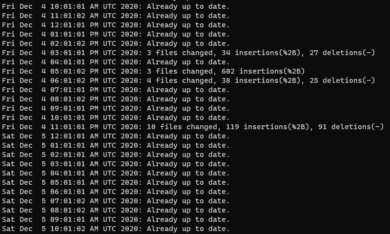

# The Details of Bots

## Daily Metasploit Changelogs 

This bot daily posts the Metasploit GitHub repository changes. The purpose of these messages is that following the offensive security news. **You can join my channel from https://t.me/dailymsf**

If you want, you can follow the daily changes locally on Metasploit by pulling each day. You can follow the steps from [here](https://github.com/rapid7/metasploit-framework/wiki/Setting-Up-a-Metasploit-Development-Environment#set-up-your-local-copy-of-the-repository) for this.

The messages look like this:

Also, you can customize your log. My logs look like this:

